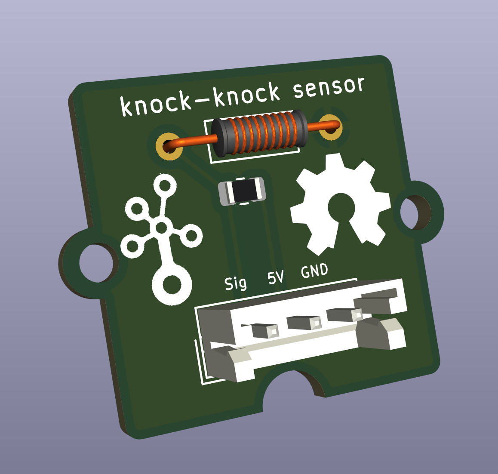
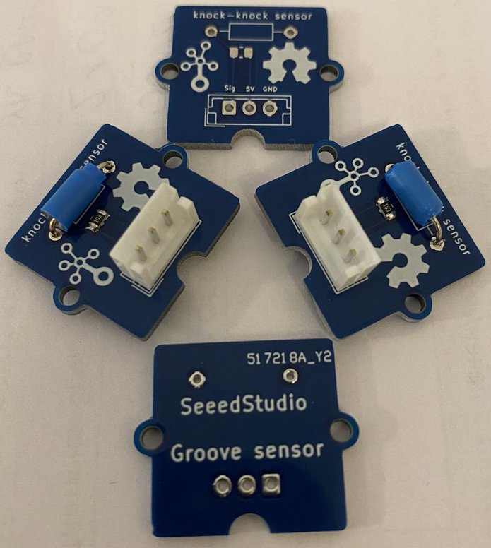

# Groove Knock-Knock Sensor for SeeedStudio

## Previews

KiCad View|Seeed PCB
------|------
|

## Code

````c
const int knockPin = 8;

int knockVal = HIGH;
boolean knockAlarm = false;
unsigned long prevKnockTime;
int knockAlarmTime = 100;

void setup () {
  Serial.begin(9600);  
  pinMode(knockPin, INPUT) ;
}
void loop () {
  knockVal = digitalRead(knockPin);
  
  if (knockVal == LOW) {
    prevKnockTime = millis(); 
    if (!knockAlarm) {
      Serial.println("KNOCK, KNOCK");
      knockAlarm = true;
      delay(1000);
    }
  } else {
    if( (millis() - prevKnockTime) > knockAlarmTime && knockAlarm) {
      Serial.println("No Knocks");
      knockAlarm = false;
    }
  }
}
````
